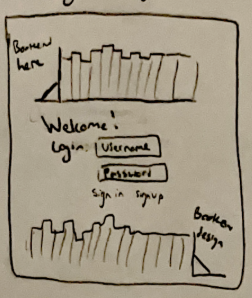
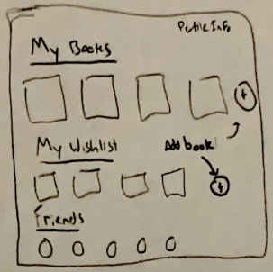
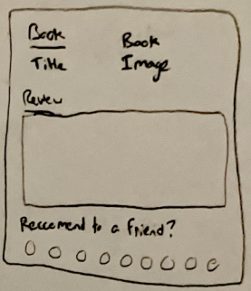
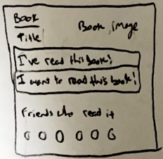

# BookClub

This website application will allow avid readers to keep track of the books they have read, rate/comment on books they have read, create a wishlist, and share with friends.

## 🚀 Specification Deliverable

### Elevator pitch

Do you love reading books, but have a hard time keeping track of all the books you have read? BookClub lets you log books, rate them, give your opinion on the book, and create a wishlist of books that you want to read. BookClub also lets you connect with your friends to see their opinions and what they have been reading.

### Design

These diagrams show the four different pages that will make up BookClub. They are the login screen, home screen, read book screen, and not read book screen.

> This screen is where you put your login or where you can signup.

> This screen is where you can see the books you've read, the books on your wishlist, and your friends.

> This screen is where you can look at a book you have already read. You can customize your review or reccomend it to a friend.

> This screen is where you can look at a book you have not read. You can add it to your list of books that you have already read, add it to your wishlist, and see which of your friends have read the book. 

### Key features

- Secure login
- Keep track of books you have read
- Ability to upload an internet photo of a book
- Ability to comment and rate books you have read
- Keep a list of books you want to read
- Have a friends list
- Ability to reccomend a book to a friend

### Technologies

I am going to use the required technologies in the following ways.

- **HTML** - I will use correct HTML structure. There will be four main HTML pages. One for login, one for a home screen (this will show books read, wishlist of books, and friends), one for a read book screen (this will show the book title, an image if applicable, the review, and an option to share it with a friend), and one for books not read (this will allow you to add a book to your wishlist or mark that you've read it).
- **CSS** - I will use CSS to create an aesthetically pleasing style. I will also use it to create website that is easy to navigate and feels natural
- **React** - I will use React to allow the user to login, add books, search for a friend, and comment on books.
- **Service** - I will use Service for backend service with end points for the login and add books/photos using Open Library API
- **DB/Login** - I will use DB/Login to store user info, book database, wishlist, read book list, and friend list.
- **WebSocket** - Book comments, book additions, and friend additions occur in real time and can be seen immediately after it is finished.

## 🚀 AWS deliverable

For this deliverable, I created a website with an elastic IP address and purchased a domain name. The link to the website is below. I also secured my website by configuring Caddy to request a certificate from Let's Encrypt

> IP address is 23.20.217.119\
> Domain Name: bookclub260.click

- `[x]` **Server deployed and accessible with custom domain name** - [BookClub](https://bookclub260.click).

## 🚀 HTML deliverable

For this deliverable I did the following. I checked the box `[x]` and added a description for things I completed.

- `[x]` **HTML pages** - I created all of the HTML pages that I need.
- `[x]` **Proper HTML element usage** - I used proper HTML elements. I used all the tags specified as well.
- `[x]` **Links** - I use links to access all of my HTML pages and my GitHub. The Simon link works too.
- `[x]` **Text** - I provided textual content where necessary and applicable
- [ ] **3rd party API placeholder** - I did not complete this part of the deliverable.
- `[x]` **Images** - I put images in my application. I also have some images as placeholders.
- `[x]` **Login placeholder** - I have a placeholder for the Login.
- [ ] **DB data placeholder** - I did not complete this part of the deliverable.
- [ ] **WebSocket placeholder** - I did not complete this part of the deliverable.

## 🚀 CSS deliverable

For this deliverable I did the following. I checked the box `[x]` and added a description for things I completed.

- [ ] **Header, footer, and main content body** - I did not complete this part of the deliverable.
- [ ] **Navigation elements** - I did not complete this part of the deliverable.
- [ ] **Responsive to window resizing** - I did not complete this part of the deliverable.
- [ ] **Application elements** - I did not complete this part of the deliverable.
- [ ] **Application text content** - I did not complete this part of the deliverable.
- [ ] **Application images** - I did not complete this part of the deliverable.

## 🚀 React part 1: Routing deliverable

For this deliverable I did the following. I checked the box `[x]` and added a description for things I completed.

- [ ] **Bundled using Vite** - I did not complete this part of the deliverable.
- [ ] **Components** - I did not complete this part of the deliverable.
- [ ] **Router** - Routing between login and voting components.

## 🚀 React part 2: Reactivity

For this deliverable I did the following. I checked the box `[x]` and added a description for things I completed.

- [ ] **All functionality implemented or mocked out** - I did not complete this part of the deliverable.
- [ ] **Hooks** - I did not complete this part of the deliverable.

## 🚀 Service deliverable

For this deliverable I did the following. I checked the box `[x]` and added a description for things I completed.

- [ ] **Node.js/Express HTTP service** - I did not complete this part of the deliverable.
- [ ] **Static middleware for frontend** - I did not complete this part of the deliverable.
- [ ] **Calls to third party endpoints** - I did not complete this part of the deliverable.
- [ ] **Backend service endpoints** - I did not complete this part of the deliverable.
- [ ] **Frontend calls service endpoints** - I did not complete this part of the deliverable.

## 🚀 DB/Login deliverable

For this deliverable I did the following. I checked the box `[x]` and added a description for things I completed.

- [ ] **User registration** - I did not complete this part of the deliverable.
- [ ] **User login and logout** - I did not complete this part of the deliverable.
- [ ] **Stores data in MongoDB** - I did not complete this part of the deliverable.
- [ ] **Stores credentials in MongoDB** - I did not complete this part of the deliverable.
- [ ] **Restricts functionality based on authentication** - I did not complete this part of the deliverable.

## 🚀 WebSocket deliverable

For this deliverable I did the following. I checked the box `[x]` and added a description for things I completed.

- [ ] **Backend listens for WebSocket connection** - I did not complete this part of the deliverable.
- [ ] **Frontend makes WebSocket connection** - I did not complete this part of the deliverable.
- [ ] **Data sent over WebSocket connection** - I did not complete this part of the deliverable.
- [ ] **WebSocket data displayed** - I did not complete this part of the deliverable.
- [ ] **Application is fully functional** - I did not complete this part of the deliverable.
